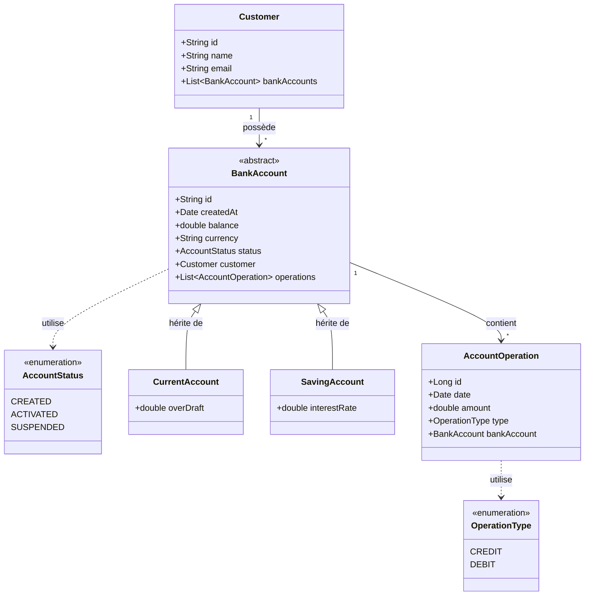

# 🏦 Digital Banking System (Full Stack)


A comprehensive **Full Stack Digital Banking Application** featuring a robust **Spring Boot** backend protected by **Spring Security & JWT**, and a modern, sophisticated **Angular** frontend.

This system manages customers, banks accounts (Current & Saving), financial transactions, and user authentication with role-based access control (Admin/User).

## 📐 Class Diagram (UML)



## 🚀 Features

### Backend (Spring Boot)
*   **Security**: Stateless authentication using **JWT (JSON Web Tokens)**.
*   **Role-Based Access Control**:
    *   **ADMIN**: Manage customers (Create, Delete), View all accounts, Perform operations.
    *   **USER**: View own accounts and operations.
*   **Customer & Account Management**: Complete REST API for managing banking data.
*   **Transaction Processing**: Credit, Debit, and Transfer operations with transactional integrity.
*   **Architecture**:
    *   Layered Architecture (Controller -> Service -> Repository).
    *   DTO Pattern & MapStruct.
    *   Global Exception Handling.

### Frontend (Angular)
*   **Modern UI**: Built with **Angular 17+** (Standalone Components) and **Bootstrap 5**.
*   **Authentication**: Login page with JWT storage in LocalStorage.
*   **Security**: `AuthGuard` to protect administrative routes and `HttpInterceptor` to attach tokens automatically.
*   **Customer Management**:
    *   Searchable Data Table.
    *   AJAX deletion updates.
    *   Reactive Forms for creating new customers.

---

## 🛠️ Tech Stack

### Backend
*   **Framework**: Spring Boot 3.2.0
*   **Security**: Spring Security 6, JJWT (0.11.5)
*   **Database**: H2 (In-Memory)
*   **Build**: Maven

### Frontend
*   **Framework**: Angular 17+
*   **Styling**: Bootstrap 5, Bootstrap Icons
*   **Build**: Angular CLI / NPM

---

## 📂 Project Structure

```
digital-banking/
├── digital-banking-web/   # Angular Frontend Source Code
├── src/main/java/         # Spring Boot Backend Source Code
├── pom.xml                # Maven Configuration
└── README.md              # Project Documentation
```

---

## ⚙️ Setup & Installation

### 1. Backend Setup
Navigate to the root directory and run the Spring Boot application.
```bash
mvn spring-boot:run
```
*   Server starts on `http://localhost:8085`
*   H2 Console: `http://localhost:8085/h2-console`

### 2. Frontend Setup
Navigate to the angular project directory and start the dev server.
```bash
cd digital-banking-web
npm install  # Install dependencies (first time only)
npm start
```
*   Application opens at `http://localhost:4200`

---

## 🔑 Login Credentials

The application is seeded with the following users:

| Role | Username | Password | Permissions |
| :--- | :--- | :--- | :--- |
| **ADMIN** | `admin` | `1234` | Full Access (Manage Customers, Accounts) |
| **USER** | `user1` | `1234` | Basic Access |

---

## 🔌 API Endpoints (Backend)

*   `POST /auth/login`: Authenticate and receive JWT.
*   `GET /customers`: List customers (Requires Authentication).
*   `POST /customers`: Create customer (Requires ADMIN).
*   `GET /accounts/{id}/pageOperations`: Get account history.

---

## 🎨 Screenshots
*(Add screenshots of your Login page and Customers table here)*

## 📄 License
This project is licensed under the MIT License.
