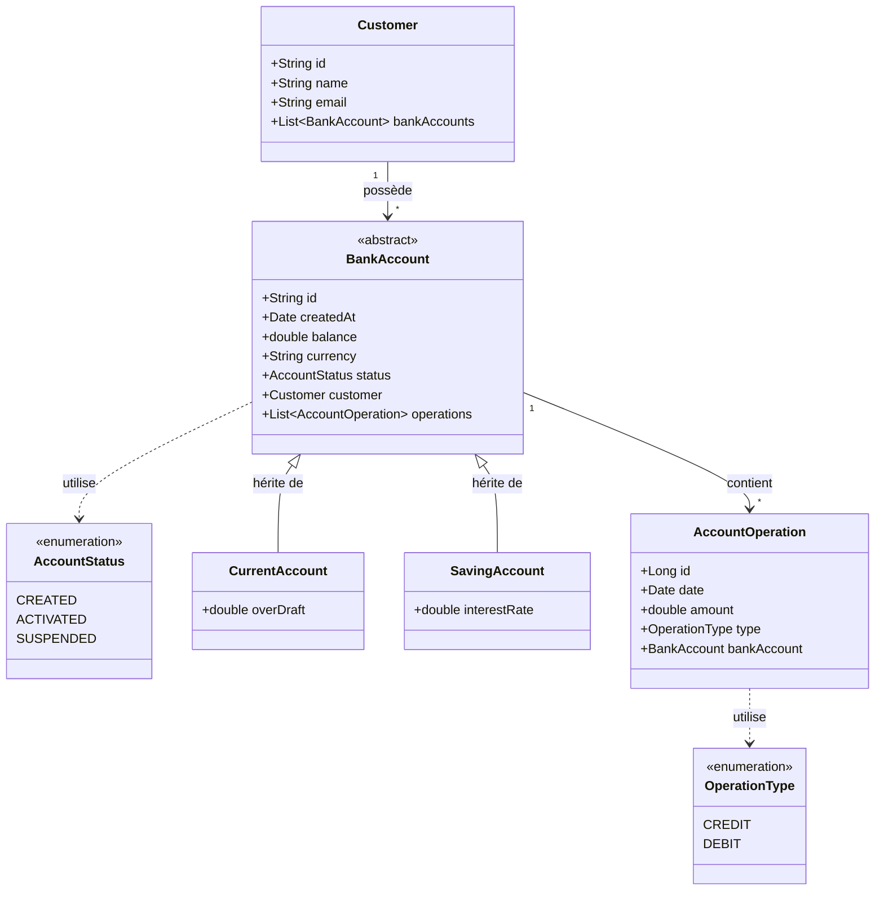

# 🏦 Digital Banking Backend


A robust and scalable RESTful API for a Digital Banking system, built with **Spring Boot**. This backend application manages customers, bank accounts (Current & Saving), and processes financial transactions (Credits, Debits, Transfers) with a clean architecture and modern best practices.

## 📐 Class Diagram (UML)

Below is the UML Class Diagram representing the core entities and relationships in the system.



## 🚀 Features

*   **Customer Management**: Create, update, delete, search, and list customers.
*   **Account Management**:
    *   Support for **Current Accounts** (with Overdraft protection).
    *   Support for **Saving Accounts** (with Interest Rates).
    *   View account details and balances.
*   **Transaction Processing**:
    *   Perform **Credit** and **Debit** operations.
    *   Execute **Fund Transfers** between accounts.
    *   Transactional integrity ensures data consistency.
*   **Account History**: View paginated lists of account operations (statements).
*   **Architecture**:
    *   **Layered Architecture**: Controller -> Service -> Repository -> Entity.
    *   **DTO Pattern**: Separation of Domain Entities and Data Transfer Objects using **MapStruct**.
    *   **Exception Handling**: Global exception handling for robust error responses.

## 🛠️ Tech Stack

*   **Core Framework**: [Spring Boot 3.2.0](https://spring.io/projects/spring-boot)
*   **Language**: Java 21
*   **Database**: H2 Database (In-Memory for Dev/Test), compatible with MySQL/PostgreSQL.
*   **ORM**: Spring Data JPA (Hibernate).
*   **Boilerplate Reduction**: [Lombok](https://projectlombok.org/).
*   **Object Mapping**: [MapStruct](https://mapstruct.org/).
*   **API Documentation**: SpringDoc OpenAPI (Swagger UI).
*   **Build Tool**: Apache Maven.

## 📂 Project Structure

```
com.digitalbanking
├── dtos           # Data Transfer Objects (API Request/Response models)
├── entities       # JPA Entities (Database models)
├── enums          # Enumerations (AccountStatus, OperationType)
├── exceptions     # Custom Exceptions
├── mappers        # MapStruct Interfaces for Entity <-> DTO mapping
├── repositories   # Spring Data JPA Repositories
├── services       # Business Logic Interfaces and Implementations
└── web            # REST Controllers (API Endpoints)
```

## 🔌 API Endpoints

### Customers
*   `GET /customers`: List all customers.
*   `GET /customers/search?keyword={name}`: Search customers by name.
*   `GET /customers/{id}`: Get customer details.
*   `POST /customers`: Create a new customer.
*   `PUT /customers/{id}`: Update an existing customer.
*   `DELETE /customers/{id}`: Delete a customer.

### Bank Accounts
*   `GET /accounts/{id}`: Get account details (Current or Saving).
*   `GET /accounts`: List all bank accounts.
*   `GET /accounts/{id}/pageOperations`: Get paginated account history.
*   `POST /accounts/credit`: Credit an account.
*   `POST /accounts/debit`: Debit an account.
*   `POST /accounts/transfer`: Transfer funds between two accounts.

## ⚙️ Setup & Installation

1.  **Clone the repository**
    ```bash
    git clone https://github.com/SoufianeMajd/digital-banking-backend.git
    cd digital-banking-backend
    ```

2.  **Build the project**
    ```bash
    mvn clean install
    ```

3.  **Run the application**
    ```bash
    mvn spring-boot:run
    ```
    *Alternatively, run the `DigitalBankingApplication.java` class from your IDE.*

4.  **Access the Application**
    *   The server will start on `http://localhost:8085`.
    *   **H2 Console**: `http://localhost:8085/h2-console` (JDBC URL: `jdbc:h2:mem:digitalbankingdb`, User: `sa`, Password: empty).
    *   **Swagger UI**: `http://localhost:8085/swagger-ui.html` (if enabled).

## 🧪 Testing

The application comes with a `CommandLineRunner` that automatically seeds the database with:
*   3 Customers (Hassan, Imane, Mohamed).
*   Random Current and Saving accounts for each customer.
*   10 random transactions (Credits/Debits) for each account.

You can immediately test the endpoints using Postman or `curl` after startup.

## 🤝 Contributing

Contributions are welcome! Please fork the repository and submit a pull request.

## 📄 License

This project is licensed under the MIT License.
